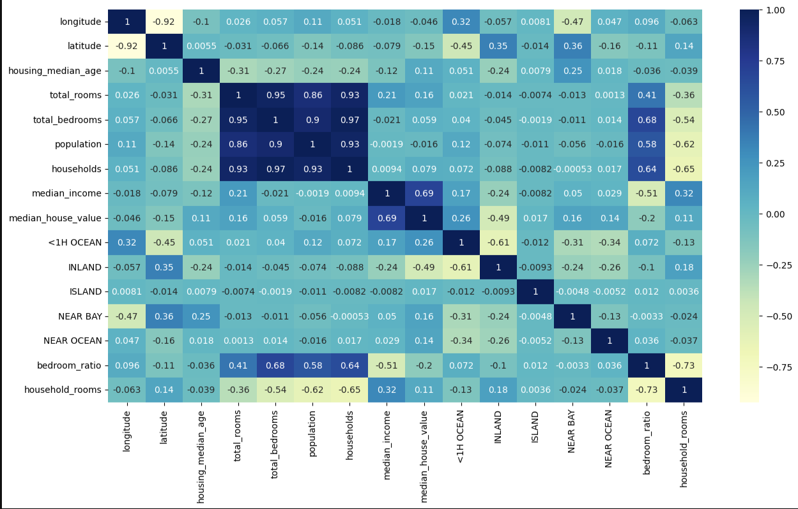
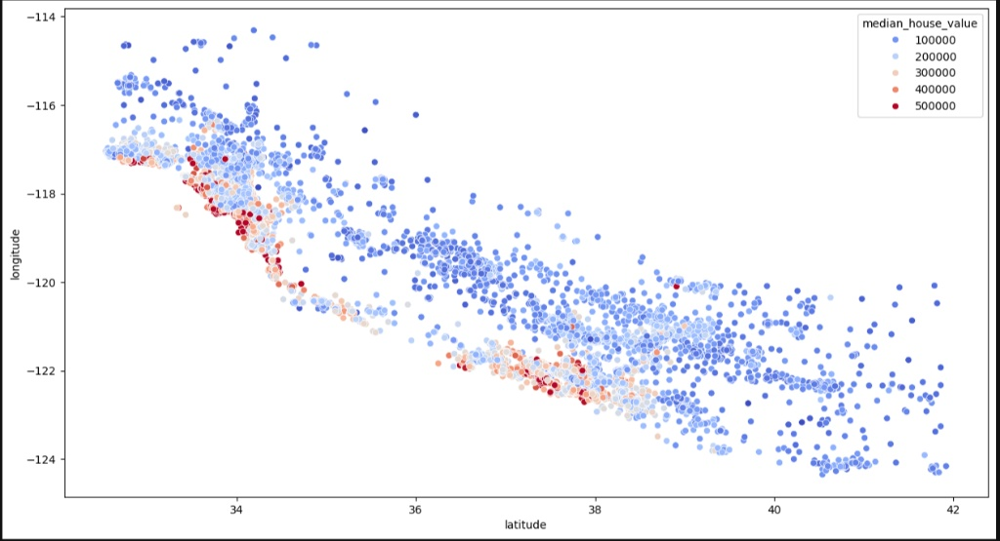

# Project Title: House-Price-Prediction-Model
**Description:**
A machine learning project in Python to predict California house prices. This project covers the complete data science workflow from data loading and cleaning to model training, hyperparameter tuning, and evaluation.

---
## Exploratory Data Analysis (EDA)

Here are the key visualizations from the project.

### Correlation Heatmap
This heatmap shows the correlation between all features. `median_income` has the strongest positive correlation with our target, `median_house_value`.

### Housing Price by Location
This scatter plot shows that properties closer to the coast (especially around San Francisco and Los Angeles) are significantly more expensive.

---

## 💾 Dataset
The dataset used for this project is the **California Housing Prices** dataset, available on Kaggle:
[https://www.kaggle.com/datasets/camnugent/california-housing-prices](https://www.kaggle.com/datasets/camnugent/california-housing-prices)

---

## 🚀 Models Used
* **Linear Regression** 
* **Random Forest Regressor** 

---

## 📚 Libraries & Technologies
* **Pandas:** For data loading and manipulation.
* **NumPy:** For numerical operations.
* **Matplotlib & Seaborn:** For data visualization.
* **Jupyter Notebook:** For interactive development.
* **Scikit-learn:** For all core machine learning tasks:
    * `train_test_split` for splitting the data
    * `StandardScaler` for feature scaling
    * `LinearRegression` and `RandomForestRegressor` for modeling
    * `GridSearchCV` for hyperparameter tuning

---

## 📂 How to Use
1.  Download the dataset from the link above and place `housing.csv` in the project folder.
2.  Clone the repository:
    `git clone https://github.com/ArpanMoharana/House-Price-Prediction-Model`
3.  Install the required libraries:
    `pip install -r requirements.txt`
4.  Open the `YourNotebookName.ipynb` file in Jupyter Notebook or JupyterLab.
